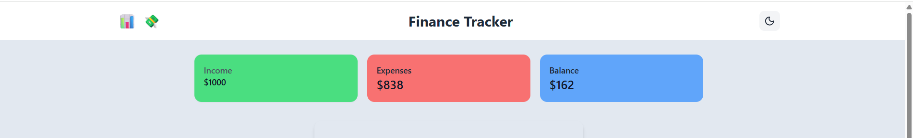
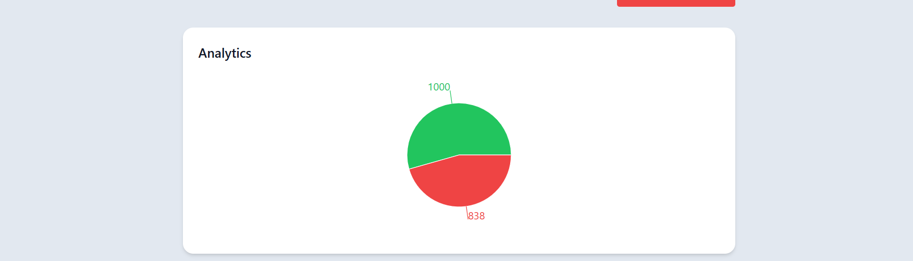

 💸 Finance Tracker Dashboard

A modern Finance Tracker web application built with React, TypeScript, Tailwind CSS, and Vite.
It allows users to track income and expenses, visualize financial data, and manage transactions with full CRUD functionality.

---

🔗 Live Demo

👉 https://your-netlify-link.netlify.app

---
✨ Features

- ✅ Add, edit, and delete transactions (CRUD)
- 📊 Analytics dashboard with charts (income vs expenses)
- 🌙 Dark mode with persistent theme
- 💾 Data persistence using `localStorage`
- 🧹 Clear all transactions
- 📱 Responsive UI (desktop & mobile friendly)
- 🧩 Clean component-based architecture

----

🧠 Why this project?

- This project was built to practice and demonstrate:
- Real-world React state management
- ypeScript for safer and scalable code
- Component separation and clean architecture
- UI/UX thinking (dark mode, confirmations, empty states)
- Building a dashboard-style application without a backend

---

🛠️ Tech Stack

- React (Hooks)
- TypeScript
- Vite
- Tailwind CSS
- Recharts (analytics & charts)
- Lucide Icons
- UUID
- Netlify (deployment)

----

📂 Project Structur

src/
├── components/
│   ├── Header.tsx
│   ├── SummaryCards.tsx
│   ├── TransactionForm.tsx
│   ├── TransactionList.tsx
│   ├── TransactionItem.tsx
│   └── Analytics.tsx
├── hooks/
│   └── useTheme.ts
├── pages/
│   └── Dashboard.tsx
├── types/
│   └── transaction.ts
└── App.tsx

----

⚙️ How It Works

- Transactions are stored in localStorage
- Dashboard calculates totals dynamically
- Analytics updates automatically when data changes
- Dark mode preference is saved across sessions
- Editing transactions reuses the same form logic

----

🚀 Getting Started Locally 
git clone https://github.com/Hinda213/finance-tracker
cd finance-tracker
npm install
npm run dev

----

🧠 What I learned

- How to desing a Dashboard style Application using reusable React components
- Managing complex state with Typscript and useState
- Data persisting using localStorage
- Implementing dark mode to all sections
- Building CRUD functionaity with out a backend

----
## 🖼️ Screenshots

### Dashboard Overview

### Add Transaction Form

### Analytics View

### Dark Mode

----

👤 Author

Hinda Mohamoud
Frontend Developer focused on React & TypeScript

🌐 Portfolio: https://github.com/Hinda213/hindas-portfolio

🐙 GitHub: https://github.com/Hinda213